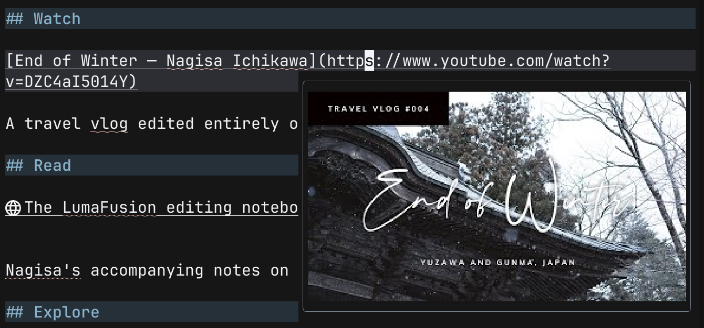
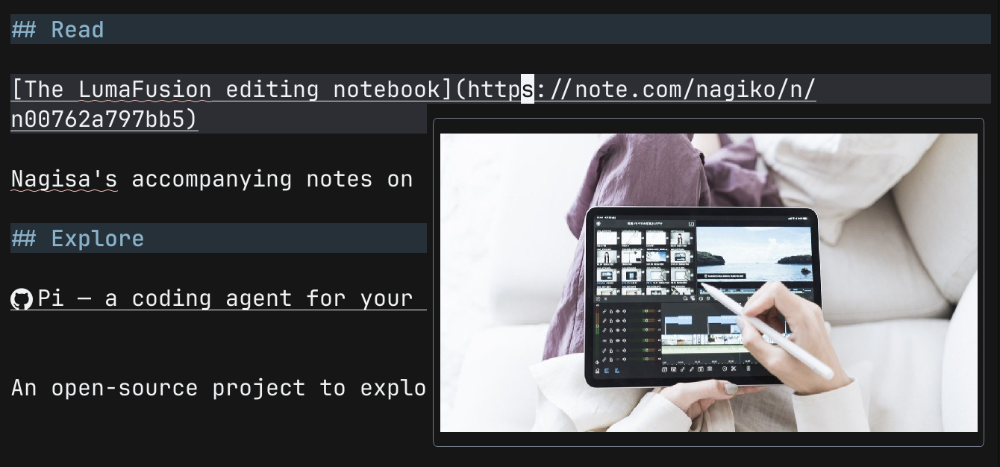
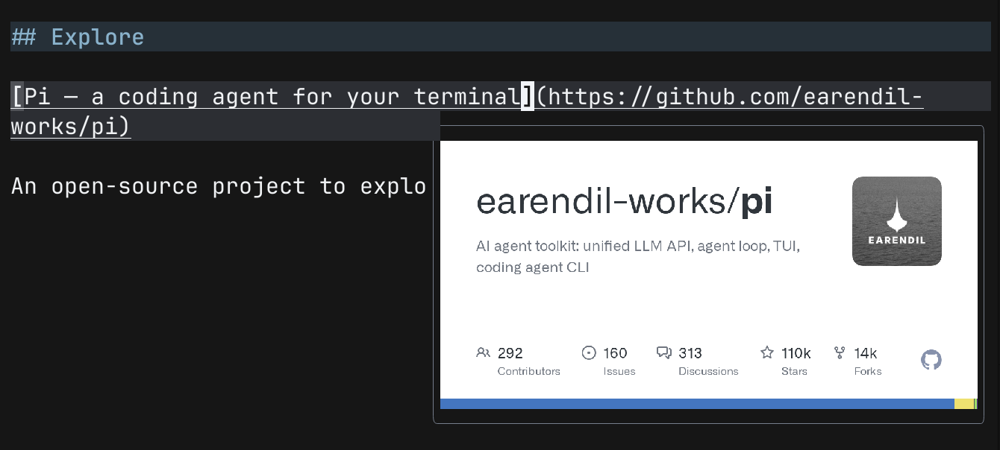

# link-preview.nvim

Preview Markdown links in Neovim with Open Graph images and YouTube thumbnails,
powered by [snacks.nvim](https://github.com/folke/snacks.nvim). Pause the cursor on
a link in normal mode to show a preview; move away to close it.

**YouTube thumbnail preview:**



**Article Open Graph image preview:**



**GitHub repository preview:**



## Requirements

- Neovim 0.10+
- `curl`, ImageMagick, and a terminal supported by Snacks images
- The `html`, `markdown`, and `markdown_inline` Tree-sitter parsers

## Setup

Add this to your [lazy.nvim](https://github.com/folke/lazy.nvim) plugins:

```lua
return {
  {
    "wu-json/link-preview.nvim",
    main = "link-preview",
    event = "VeryLazy",
    dependencies = {
      { "folke/snacks.nvim", opts = { image = { enabled = true } } },
    },
    opts = {},
  },
}
```

The defaults work for Markdown and MDX. To adjust the preview, set
`opts = { delay = 200, max_width = 40, max_height = 12 }` (milliseconds, columns,
and rows). More options are in [the setup code](lua/link-preview/init.lua).

Previews fetch the linked page and image, cache metadata, and show a text fallback
when no image is available.

## License

[MIT](LICENSE)
